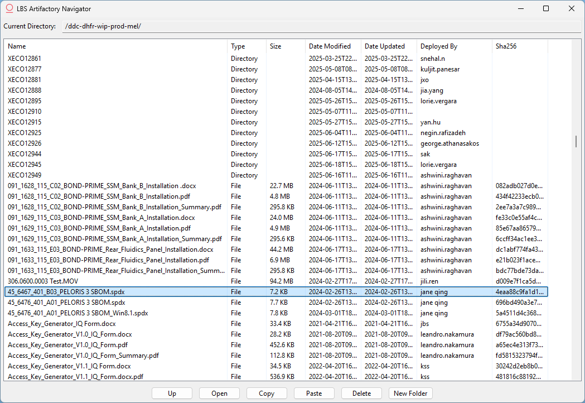
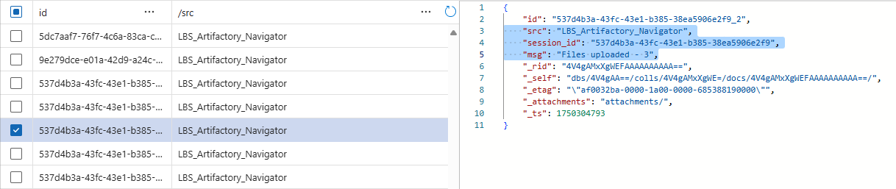

# LBS Artifactory Navigator

 
![Powered by Artifactory](https://img.shields.io/badge/DOHQ%20Artifactory-1f2f4a?logo=data:image/png;base64,iVBORw0KGgoAAAANSUhEUgAAAEAAAABICAYAAABGOvOzAAAABGdBTUEAALGPC/xhBQAAAAlwSFlzAAAOwwAADsMBx2+oZAAAC59JREFUeJztXAdwFNcZftf76YpOp1NHiCKKkBBIGFOEAwgEiI4zNmACwdjRjG0Yl4DH9sQeJy7jkNiGwJAJZoCQYAyhC0yRqaJaqNLV60l30t3pesn7FY4smz3dnXSSToFvZgfu392373373v/+tmIWFRWhpxnM3n6g0+VgOVx2js1p5btcTgbI6DSGlcXgGBk0ppWGaI7e7E+PE2CyG+RqS01yo7EytcVcN6LN1hJrsuvDrE6LEBPQ8XwGnWlh07k6ATOkXsJRPFBwowrDeDE3QrkRJUwa29iT/esRAvDbFVQZbr9wT3dzQY3hbobepol2IRfD233NqHZkpeFRx+gss5StvBMnGp47SJyyP5w/4GpP9DWgBFidppAy7dWXirQXVjeZqlK605bdaeOqzTWj4Pi55cyb0YKhp5PlGZsxIcfxMnEFqs8BI+B267VfXlPnrscdTkIBBpBRri+aVaEvzooXjzySHjbrk3Be3LVAtN1tAnTWltjzDfs/v9N2/UVv14KS4zFFTUK81nlMYQv+bcZLgw4KEesFhcHWGmF2GuVYN9Cp7sfX0h7oCudUGe5MSVNkfpEaOv1LWCrd6X+3CKjQl2Servv75jZrc7yna/h4wFGCwXkxwqFnQbGFsEMrWHSOwa3xYVB4aAy7086xONqlGmvjkPr28vSq9rKp8K/dZeWT27RhBXqx8dDHNe33J0yLWrpGzJJXdHUMXSagUHNuTV7d3o12l41HdR5r8lvDpeO3J4SkHBCzZFWe2vnPeqbZWXQ2HO1ClrQmBq/3NJT5hdpUO6Ks9cpSOIx2nZJ8b6WhdPoP5X/OzYpetVTJi73elXF0iYAbzafW/VT//VdU52CwYxSZnw+TjNvJZnD1qIugIbo9jBddAEeKfMom/My3ijTnV5MJ11oahxys3HxwVvTqJZGChIv+PsdvAgpazuZ4GvxQSdruCcp574vZ8koUQOD2yqdEvPjm4JDRP5yt3/sn8g4DuuNo1bZ/zo3LmavEy8yftv0i4L6uYF5e/fcbyXK8ni0TwudvSA2d+kfUg4gUDDq3aMDaX+RhEkq1l5cTzxnsrZHHq/+2c8GAN2Z0tuTI8JkAjaVh6Jm6PZvAlCXKOQyeblrkslWDQ1L3oV4Al8HXZka9soLPEDVdbz759pN9rE88Xbt7a3bs6/PgpfjSnk8EwKCBdZhqT9yMzVToTII45QDqRYDinKRa+A78n0xCub54xs3mU2vHKmZ85ktbPhFQqDm/BrY8sjwjYvG63h48ERNVC941OvRh5OVwpSn3t7HCYSfwtvuztza8EmCwaaOwhfcuWZ6MNXOSbNJW1IeAmZChWry22Vw7kqgYwSTPbzr2QXbsawu8teGVgFuac6/pbdpoogy8tfHK7A9QEIDLEGimqJa8BfYAcYt8oCvIrjKUTY0RJp7q7P5OCYC3X6K5tIIoA9bx4D8EZYSCBLA7jJRN3IadpjfcMvA+C1rycrpFwN22mwtheyHK4kQjjsWLkw6hIANswXfbbixpt7eFu2UV+tLpTeaq0WHcmJue7vNIAGh+7M8vJsrg7aeETtkUSHc0UADjK1GavvO6+uQ7bhn4EffbCuZ3iYBmS+3IRlNlKlGm5MddixYMOYOCFImS9N23WvJ+AwEZtwy70TPTFDM/9eQ1eiSgxnBvIvjhRFmCOPlfvhoYfYFQTkSRij/wMig/t6zFXD8MDCRPW6JHAhpM5eOIv2Hgwfz2ATQa3RkrTPyRSADsDA2myjF+EQBTqNlcN5wow2usQsYJL0NBjgh+fD54ki7kfDy2ZnNNsqfrKQkwOSA6o40iyuSciFKw+1GQQ8IJu8tnidTttjaVW6a1NCXAtkgVcqckoN2mCycqko6G2YoHqB8AG0ZaEUtWTSQAb40qh8vGoQqxUxJgdhjkTsIUAghZIbWoHwCSLAKmqJEoMzuMUpvDymcyfSQA3j45MMlh8NtQPwDYKCw610CU4bfPcyA7h+p6n+MBvZ2y6hbwgn/iJ36ZTqeDTXWpJwKc/yNwOVmov4DmemL2wq6Alwal/UJJAJvO1T8KWT9OZ5kd7TLUDwBv22w3hhBlkHj1yxLsSFrQmTZsCT4mAPJ7qB/AgRwco0OnIsrAZWbS2Saq6ykJELBC6lk0jt6O/msKd+ylmF2wtlAQw2jXK/QkG0bEktRAForqekoCuHRBC2RwTCaDwi3D9vRwvJ3I8OxoRkGMFnPdMOgnUSZlh9/x5MFSEgDrJZQbWdRgqhjrluntrVFqc3WytwBDX6PO+GACeQsP40d7jA163AYjBQkXirUXV7p/Q6MV+tLMYCYAvNdKfel0ooxN57UpeXEe02aeCeAnnMe2f6vFYZK4ZRBnSw/L+hTkKAhRjz3YRlLWSMmPudmZGe+RAOxU3I8UDLrwUFc42y3TWpsG39cVzB0ufW4HCkKUaC6udJFM+HhR0uHOjLhOLcGhIWP/QSQAcKslL2eIZMxeJo1lQkEEiP1BSQ5RBgo7QZx8sLP7OiVggGjkYTlXVQpRFbcMFGOx5sJKyAugIMKVpuMbyB7sIHHKAbybPezsvk4JAP9/lCzjL2fq9nzzxMPUx9+PFQ47KeUo76EgwO3Wqy/fa7u5kCiDIowk2eTN3u716gwNk4zbUay9sKrJVP04qgK+NuQKs2Nfnw+VHqgPAfG+nxr2fUmWYz31HdQWeLvfKwFQ5PBc2JyPDlVtOUDcX8v1xVkXGg58Nlm1eB3qI8AO9WPtrm3E4AcASmbSwmYGLjk6UDzq0Ajp838t0px/lSi/0XxqLY8pUqcpZvwB9TJgvefWbN9R237/efK5CeHzNgiZEp8COD7HAyaGz1/fZKoa3WiqHEOU41nwe7vTyh2vzP4I9RKg+vRk7Y7tUDFGPpcsz/h2qCRtj69t+UwAeFTTo5b/en/517nE9BMgv+noh9hbjJ2sWrK2p3OGkAU+Vbt7K9FMdwMU88TwBev9ac+vEhmo/JoR/avlR6q27sPrT0w8V6K9/ApUdU5SLXobqrxQgAGpukLNuVcvNR7+mCo2AaW0M3HfQPv7067fRVKQeMiKXvUS1ONAsJF4DnaKA+XfHEuUpO9KVUzdKOdEFKNuAoIyFfqSadfVJ96rbr+bQXWNij8gf3bMmiV8prgR+YkulclhA+koVGSdqP5ue6tVPZB4zuGys8GJwlbZooGiUQcTpem7cAevgFPizzOgHKfSUDatrDV/OQzcU/VonHD4cTwrV0BBZlfG0uVCSXCWFg1YOw1vQ1ugYJF8HpZIaWv+MjhkHFVZhCD+kooXnw/ZJSFLUo9dbiMdMWz4UhpMb6vTLNbZNDHY5R5V1/5wfIOxPI2cmicCAjOpoVO/AuXbHbO8W6WyUL83Ly4nG4qSrqpz3yN6jkSAsQJHMbq4CjrOoXPb2NjKfBSlodscFr7FaQqBElhfngvm+QTl/A14ez6IuoluF0tD0hQqsuLFSUeuNB5fj6f+QvgixNP1HUFLrDvI+sMXwDRPkk3akiJ/4WuIW6IAIGDl8qDwsmJWvVxvnPIt1BE/1BfNhv06EG2Daw6eKdQee3Nu/EXAvxhR8eMvwwHKsUJfPOOhrmgWfDJjtOuVnhQZGTCrRCxpTQR/4CU8sw5DWj5Qb5yMHvtmCKIw4DLDAcrMXajQalEPxIZUBF4CEocLos40J5vOMWJDqxkrx1rsYd6VY6Up5YTf7o1CrF75agzscqFQUgs2BFEO3wr0db1Rr382RwQtCIqt+pSAYMAzAtBTjmcEoKcczwhATzmeEUAlxG6p4FLj4d+ZHYZQGqL3n+IoCjiRk86is03jFLM+gcIP8nlKAiDNXNaavww7MGHo/wCQHE2WZWzymYCOEx5qavojYCw0Go2ytKeTDyacXv/gQX+Bq5OxUBKA2XJBqRyUykCNHerHcLlcdEjv4XH4PgOgLHZeXM4c8lei/RUQhxSzZBVU56hnAFYa/aU6vLv4Nxb5QRr/sjb0AAAAAElFTkSuQmCC) 
 

---
@Author(s): Mark Evans  
@Version: 1.0.20250620  

---------


## Summary:
This is a simple file explorer for navigating Artifactory:



## Features:
- Username / Password can be encrypted and saved locally for quick login
- Drag / Drop files to upload
- Drag / Drop files to download
- Supports the following shortcut keys:
    - Control + C : Note this downloads the highlighted files to a temp folder, so they can be pasted natively into Windows File Explorer, etc.
    - Control + V : Note this will upload the files
    - Alt Left : Simple implementation to go 'up' a directory
    - Control Shift N : Make a folder & open it
    - Delete : Deletes the file(s) highlighted
    - Enter : Downloads and opens the file(s) highlighted, or just opens the folder, depending on what's highlighted.
- Right click Menu
    - Has options to copy the file path, the sha256 number, download the file, etc.
- When uploading ZIP files that only contain a document and a Summary file (i.e. ZIP files downloaded from DocuSign), AF Navigator will automatically unzip these files and rename the Summary file appropriately.

<div class="page"/>

## Privacy & Telemetry:
 - Note that this software does track usage in a a way that tried to be compliant with GDPR, this means:
    - No personally identifiable information is collected, or any information that could be used to track back to a user or group of users (e.g. user name, computer name, ip address, etc)
 - The information collected is intended to create justification for the time spent working on LBS AF Navigator, for example if 2hours is being saved per week using this tool it may be used as justification that more time should be spent maintaining and upgrading it.
 - The information collected is:
    - When a user logs in, and whether during login the user entered their own credentials or used saved credentials
    - If a file is uploaded, and how many
    - If a file is downloaded, and how many
    - If a file or folder is delted, and how many
    - If a folder is created
    - If a file is renamed

In the interest of full disclosure, the following is a sample screenshot of an actual log, with the information by collected by LBS AF Navigator highlighted



<div class="page"/>

## Building application
Note: I have two secrets that I don't want to commit anywhere public:
 1. The Key to access the users credentials
 2. The Key to access the Azure logs

These will be stored < TBC >, when building the application these should be put in a folder called `.env` in the root directory.

The other file that I haven't committed is the Leica Biosystems Root CA certificate.

Assuming you have access to these:

### Download from BitBucket
Link < TBC >

### Create a python environment
1. Download Python
2. Open a `command prompt` where you downloaded the repository
3. Create a virtual environment by running the command `python -m venv .venv`
4. Activate the virtual environment with `.\.venv\scripts\activate`
5. Install the required libraries with `pip install -r requirements.txt`

### Build the application
Run `auto-py-to-exe`

I suggest importing from the JSON file in `Assets/Build` and going from there, but here's the manual setup:

1. Script Location : Select main.py
2. Onefile : One Directory
3. Console Window : Window Based (hide the console)
4. Icon : Select Assets/LBS_AF_Logo.ico
5. Additional Files: Select the `.env` file with the folder `.`
5. Additional Files: Select the `Assets/LBS_AF_Logo.ico` file with the folder `Assets`
6. Advanced:
    - Name: LBS Artifactory Navigator

Hit `CONVERT .PY TO .EXE` 👍

Remember: You also need to have the `config.json` and `Leica Biosystems Melbourne Root CA.cer` in the root folder with the compiled .exe file.

For those that don't want to use `Auto Py To Exe`, you can use pyinstaller with the command:
```
pyinstaller --noconfirm --onefile --windowed --icon "C:\Python\artifactory_navigator\Assets\LBS_AF_Logo.ico" --name "LBS Artifactory Navigator" --add-data "C:\Python\artifactory_navigator\Assets\LBS_AF_Logo.ico;Assets" --add-data "C:\Python\artifactory_navigator\.env;."  "C:\Python\artifactory_navigator\main.py"
```

<div class="page"/>

## TODO
 - Testing more thoroughly
    - Testing when a connection breaks
    - Testing renaming folders
 - Show loading bars when interacting with files.
 - Show splash screen when launching, instead of it just being silent.
 - Show more detailed error messages on failures.
 - Migrate a lot of the code form app.gui.explorer, the logic (including self.current_dir) should be in app.services instead.
  - Drop / drop OUT of AF Nav not working for 'Move'. For some reason the result I get is '1', but I should get the feedback of '3' when it's moved successfully.
     - I don't want to ignore it and just go with '1' because that's the same return code I get then I didn't drag anything succesfully (i.e. dropped it in my IDE)

## Lessons Learnt
I started with wxpython because I wanted a 'native' feeling application.  
However I'm not happy with the final result, it looks a bit boring, and I feel like I think I would be happier with a tauri/svelte based application.

## What went well
The entire thing was done over 2 days of work, including this document. So sticking entirely to Python which I'm comfortable with worked well.  
I'm happy with the shortcut keys.  
I tried a handful of LLM services (ChatGPT, etc) to 'vibe code' getting the basic file explorer working with drag / drop to ensure the GUI tool selected could support it. Using the LLM meant that I didn't need to become an expert in the library before committing to it being stuck with the drawbacks. I'll also mention that deepseek was the best LLM for generating the drag/drop functionality at the time of writing.  
I spent a bit of time looking at how to encrypt the login credentials locally and encrypting it, I'm happy enough with the result.


<div class="page"/>