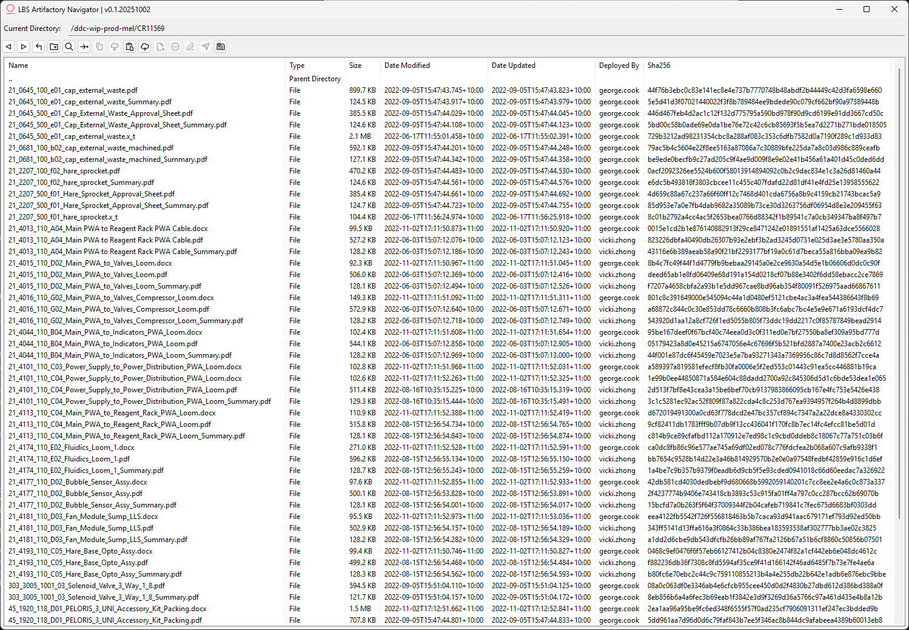
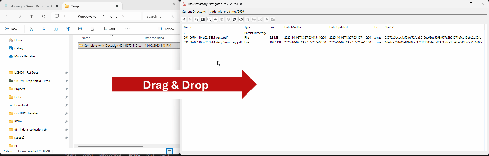
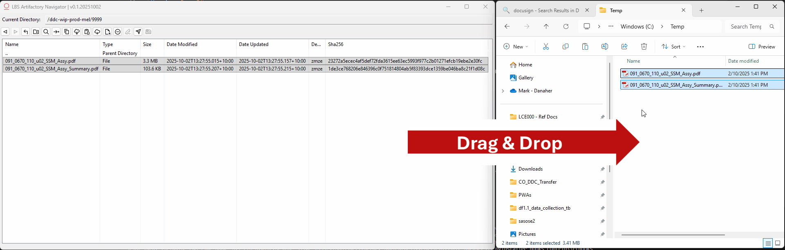
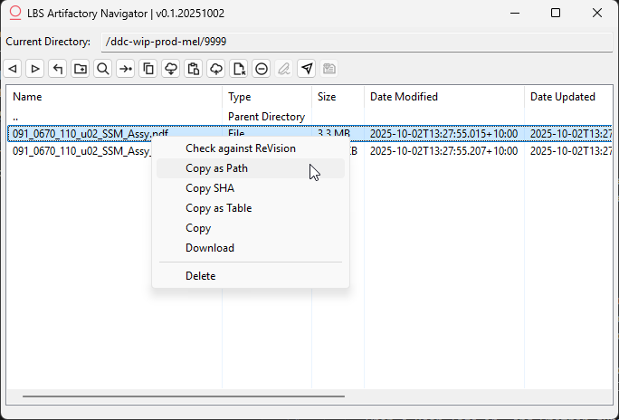
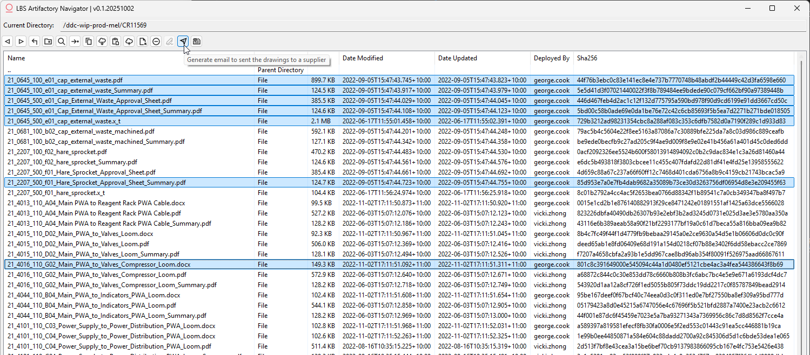
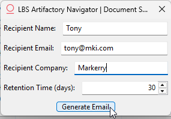
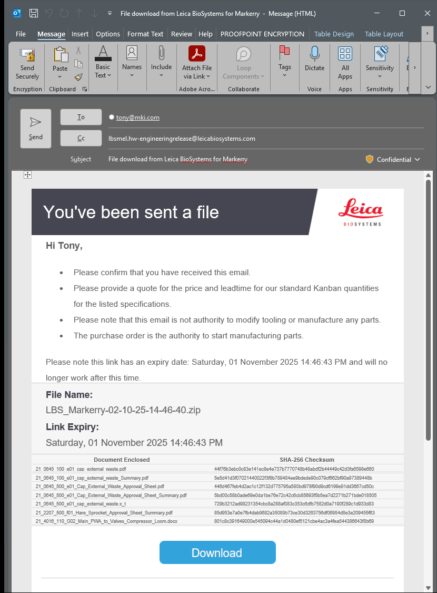
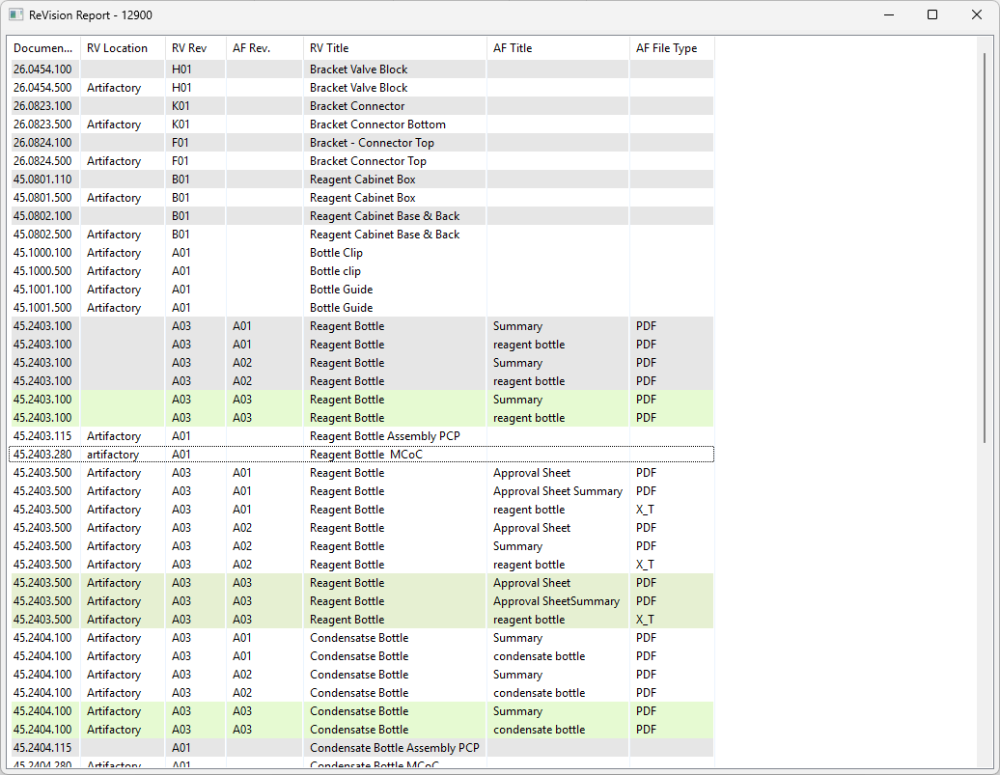
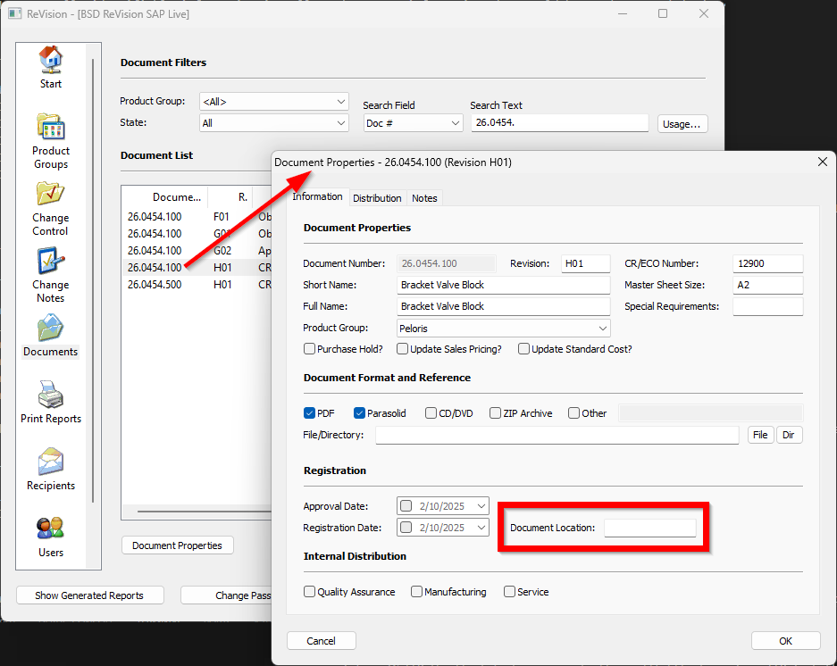

<div align="center">
    <p align="center">

# LBS Artifactory Navigator 
[](https://docs.astral.sh/uv/getting-started/installation/)
[](https://docs.wxpython.org/)
[](https://aumel-artifactory.leicabio.com/ui/repos/tree/General/)

[](https://portal.azure.com/)
[](https://github.com/MarkyXP/artifactory_navigator) 
  </p>
</div>

---------
@Author(s): Mark Evans  

---------


## Summary:
This is a file explorer for navigating Artifactory:



## Features:
- Username / Password can be encrypted and saved locally for quick login
   - 
   - Note that the credentials are saved to `%LocalAppData%\Artifactory_Navigator\creds.json`
- Drag / Drop files to **upload**
   - 
- Drag / Drop files to **download**
   - 
- Supports the following shortcut keys:
   - Double Left Click : This will download the file to a temp folder and open it, or opens the folder, as appropriate
   - Control + C : Note this downloads the highlighted files to a temp folder, so they can be pasted natively into Windows File Explorer, etc.
   - Control + V : Note this will upload the files
   - Control + F : Opens a window allowing the user to search for a document by either its name or SHA-256 number
   - Control + G : Input a CR number (e.g. `12791`) and it will navigate to the project folder (e.g. `/ddc-wip-prod-mel/CR12791`)
   - Alt Left : Simple implementation to go 'up' a directory
   - Backspace: Simple implementation to go 'up' a directory
   - F2: Allows renaming of a file. You can also slow double left click.
   - Control Shift N : Make a folder & open it
   - Delete : Deletes the file(s) highlighted
   - Enter : Downloads and opens the file(s) highlighted, or opens the folder, as appropriate
- Right click Menu
   - 
   - 'Check against ReVision' will check the files in Artifactory to the ones listed in ReVision
   - 'Copy as Path' will put the download link into the clipboard, and can be pasted in other applications with `Control + V`
      - If multiple files are selected the paths will be separated with a `,` character
   - 'Copy SHA' will put the SHA256 number into the clipboard, and can be pasted in other applications with `Control + V`
      - If multiple files are selected the paths will be separated with a `newline` character
   - 'Copy as Table' will put the Document Name, Modified By, and SHA256 into the clipboard, and can be pasted in other applications with `Control + V`
      - If multiple files are selected the paths will be separated with a `newline` character
   
- When uploading ZIP files that only contain a document and a Summary file (i.e. ZIP files downloaded from DocuSign), AF Navigator will automatically unzip these files and rename the Summary file appropriately.

<div class="page"/>

## Usage:

### Basic Navigation
- When first opened LBS Artifactory Navigator opens to the root Artifactory folder
- See the 'Features' above for basic navigation

### Document Shipping Tool
- The Leica Document Shipping Tool, which used to send soft copy drawings to suppliers, has been integrated to LBS Artifactory Navigtor.
- Ensure Microsoft Outlook is open in the background before proceeding.
1. To send drawings to a supplier, select the files to ship:
    
2. Fill in the supplier details, and how long they should have access for. Then click 'Generate Email'.
    
3. Review the email, modify it as needed, and send.  
   Note: The email may open in the background, you may need to click on Outlook to bring this window to the foreground.
    

### ReVision Report
When AF Navigator is in a project folder (i.e. the folder has a 5 digit number in it) a report can be generated comparing the files in the folder to the documents that are listed in ReVision as being updated:


- Items with a **GREEN** background are **MATCHING BETWEEN REVISION AND ARTIFACTORY**
- Items with a **WHITE** background are **MISSING FROM ARTIFACTORY**
   - e.g. In the above screenshot 26.0454.500 is listed in ReVision as being updated to H01, however 26.0454.500.H01 has not been uploaded yet
   - Note for 45.2403.500 ReVision expects version A03, however A01 and A02 have been uploaded to Artifactory, and they have a white background. Technically these prototype documents are not supposed to be part of the change pack, they are not listed in ReVision, and should not be distributed by DDC.
- Items with a **GREY** background are **NOT LISTED AS BEING ARTIFACTORY DOCUMENTS**
   - e.g. In the above screenshot 45.2403.100 is listed in ReVision as being updated to H01, however in ReVision's Document Properties window the 'Document Location' does not state that the file should be in Artifactory.
      - 

<div class="page"/>

## Privacy & Logging:
 - The users password is encrypted using Fernet
   - This secret is not included in this repo, ideally if you need to release a new copy of this app and you DON'T have the key, well, you should generate a new one, and the user will have to re-enter their password
   ```python
    from cryptography.fernet import Fernet
    Fernet.generate_key()
   ```
   - And put this new key in .env file (`APP_SECRET="22...="`)
 - **Nothing is collected and nothing leaves your machine.** There is no telemetry, and no outbound call is made to log anything. If this app is removed, there is no activity record to delete from anywhere else.
 - Usage is recorded to a local log file so you can see what the app has done on your own machine:
    - Location: `%LocalAppData%\Artifactory_Navigator\logs\app_YYYY-MM-DD.log`
    - Format: one JSON object per line, e.g. `{"text": "Files uploaded - 3", "record": {"time": "..."}, "extra": {"session_id": "...", "app_version": "..."}}`
    - One file per day, and anything older than a week is deleted automatically
    - Delete the `logs` folder at any time to clear it
 - The events recorded are:
    - When a user logs in, and whether during login the user entered their own credentials or used saved credentials
    - If a file is uploaded, and how many
    - If a file is downloaded, and how many
    - If a file or folder is deleted, and how many
    - If a folder is created
    - If a file is renamed
 - The log records the app version and a random per-run session ID so entries from a single run can be told apart. Your username, computer name and IP address are **not** recorded.
   - The one thing to be aware of is that a couple of events embed detail, not just a count - a ReVision report logs the report title, the Document Shipping Tool logs the file list you selected, and a failed DST email logs the traceback. These are local only, and the traceback path is the usual `%TEMP%` one the app already creates.

<div class="page"/>

## Icons
The following were my 'top 4' potential icon sets to use:
> [Icon Sets - Iconify - Siemens Industrial Experience](https://icon-sets.iconify.design/ix/)  
> [Icon Sets - Iconify - Microsoft Codicons](https://icon-sets.iconify.design/codicon/)  
> [Icon Sets - Iconify - Material Design Icons](https://icon-sets.iconify.design/mdi/)  
> [Icon Sets - Iconify - Gitlab Icons](https://icon-sets.iconify.design/pajamas/)  

I ended up settling on Siemens because it has a retro feel to use, and it feels appropraite for the industrial setting that I plan on using this app in.

<div class="page"/>

## Building application
Note: I have two secrets that I don't want to commit anywhere public:
1. The Key to access the users credentials
2. The Key to access the Azure Shipping Tool blobs

These will be stored in Github Secrets, when building the application these should be put in a folder called `.env` in the root directory.

Assuming you have access to these follow the following steps:

### Download from BitBucket
Link `https://github.com/MarkyXP/artifactory_navigator`

### Create a python environment
1. Download Python
2. Open a `command prompt` where you downloaded the repository
3. Create a virtual environment by running the command `python -m venv .venv`
4. Activate the virtual environment with `.\.venv\scripts\activate`
5. Install the required libraries with `pip install -r requirements.txt`

### Build the application
To build this application:
 1. Install [Astral's uv](https://docs.astral.sh/uv/getting-started/installation/) with the powershell command:

    ```powershell -ExecutionPolicy ByPass -c "irm https://astral.sh/uv/install.ps1 | iex"```
 2. Download this source code to a folder, open the folder in command prompt.
 3. Run the terminal command `uv sync` to download the correct version of python and the libraries needed to run the code
 4. Run `uv pip install pyinstaller` to download the library needed to create the executable
 5. Run `uv run pyinstaller pyinstaller.spec`

<div class="page"/>

## TODO
 - [ ] Testing more thoroughly
    - [x] Testing when a connection breaks
    - Testing renaming folders
 - Show loading bars when interacting with files.
 - Show splash screen when launching, instead of it just being silent.
 - Show more detailed error messages on failures.
 - Migrate a lot of the code form app.gui.explorer, the logic (including self.current_dir) should be in app.services instead.
  - Drop / drop OUT of AF Nav not working for 'Move'. For some reason the result I get is '1', but I should get the feedback of '3' when it's moved successfully.
     - I don't want to ignore it and just go with '1' because that's the same return code I get then I didn't drag anything succesfully (i.e. dropped it in my IDE)

## Lessons Learnt
I started with wxpython because I wanted a 'native' feeling application.  
However I'm not happy with the final result, it looks a bit boring, and I feel like I think I would be happier with a tauri/svelte based application.

I've done some updates to the way the password was encrypted, I'm encrypting the entire credentials store so the username will be included as well, which should enture unique encrypted stores even if users have the same password.

## What went well
The initial protoype was done over 2 days of work, including this document. So sticking entirely to Python which I'm comfortable with worked well.  
I'm happy with the shortcut keys.  
I tried a handful of LLM services (ChatGPT, etc) to 'vibe code' getting the basic file explorer working with drag / drop to ensure the GUI tool selected could support it. Using the LLM meant that I didn't need to become an expert in the library before committing to it being stuck with the drawbacks. I'll also mention that deepseek was the best LLM for generating the drag/drop functionality at the time of writing.  
I spent a bit of time looking at how to encrypt the login credentials locally and encrypting it, I'm happy enough with the result.